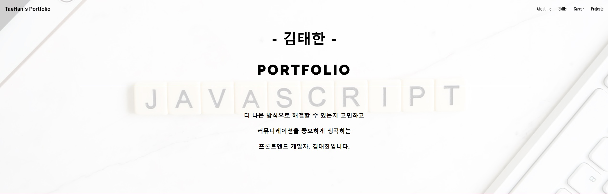

# Welcome!

##  :information_desk_person: Personal Info
>+ Kim Tae Han
>+ Kookmin University
>+  : goldmini95@gmail.com

## :blue_book: Technology Stacks
>### Frontend
>
>
>
>
>
>
>
>
>
>
>
>
>### Backend
>
>
>### Deployment
>
>
>
>### Version Control
>
>

## :pencil2: Blog
> [Tistory Link](https://daily-dev-note95.tistory.com/)

## :page_facing_up: Portfolio Website - [:hash: Click Here](https://kth-portfolio.vercel.app/)

